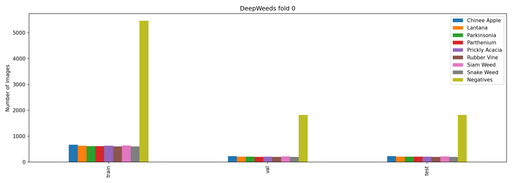
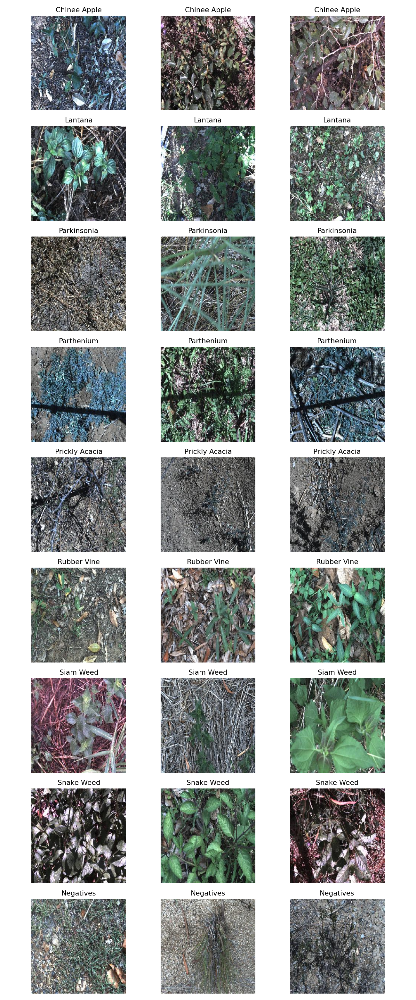
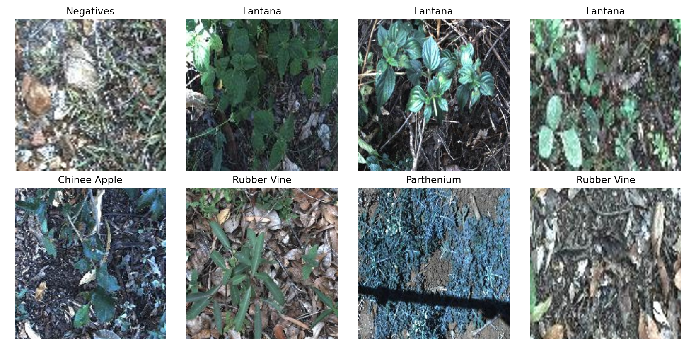
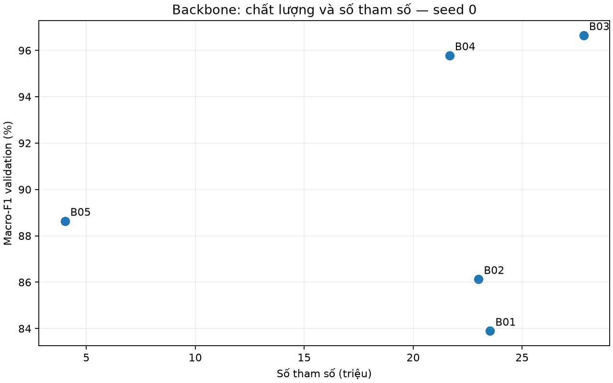
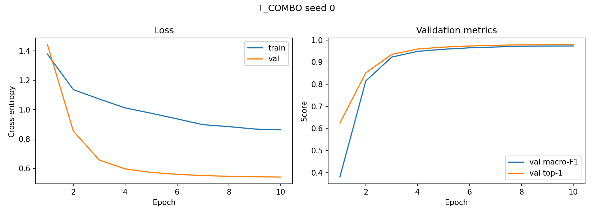
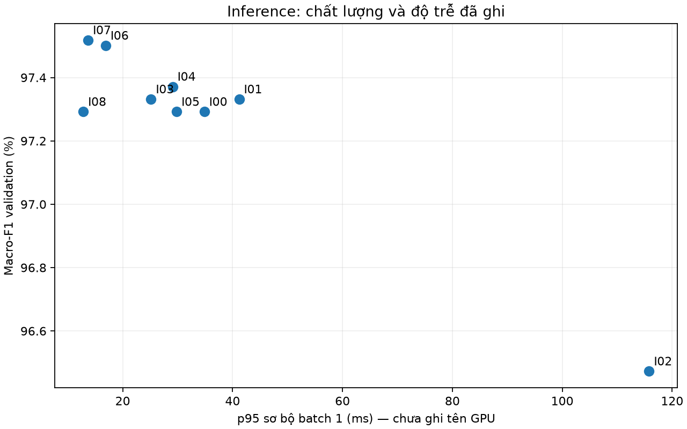
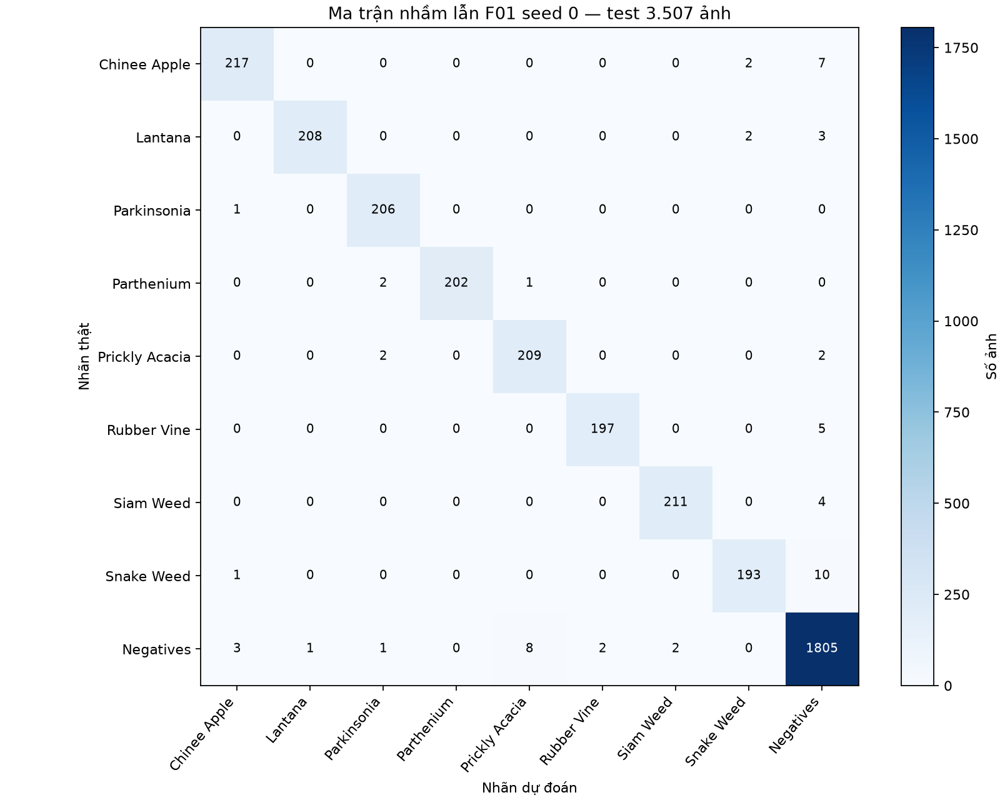
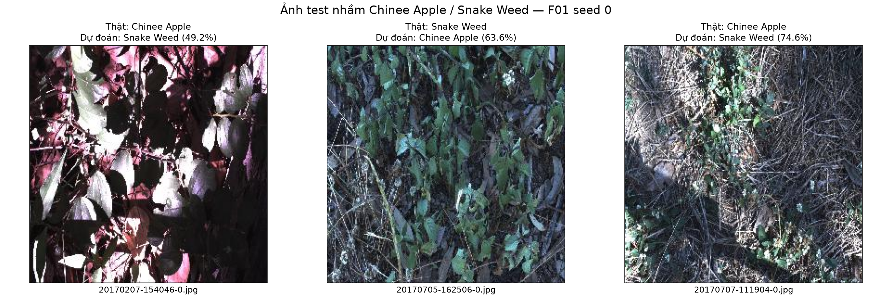

# DeepWeeds Lab Day 2 - 2A202603012 Bui Quang Vinh


## Tóm tắt

- DeepWeeds, fold 0 chính thức, 9 lớp; chọn backbone, recipe và inference chỉ bằng validation.
- Đã lưu **20 lượt huấn luyện hoàn thành / 200 epoch**, gồm 5 backbone, 10 recipe seed 0, baseline thêm seed 1/2 và final seed 0/1/2.
- Đã so sánh **9 cấu hình inference**. Cấu hình khóa: **ConvNeXt-Tiny + label smoothing + CutMix + EMA**, train 224 px, suy luận FP32 288 px (`I07`).
- Macro-F1 test baseline: **97.12 ± 0.20%** (3 seed); final: **97.98 ± 0.03%** (3 seed).
- Chênh lệch macro-F1 trung bình: **+0.86 điểm phần trăm** trên cùng bộ seed 0/1/2.
- Benchmark cuối trên **Tesla T4**, FP32 288 px: p95 batch 1 **49.85 ms**, chưa gồm đọc/resize ảnh.
- Tự chấm mục I: **18/19 điểm ở các ý đã chấm**; I4a chưa chấm vì final không dùng temperature scaling. Điểm đề xuất cần giảng viên xác nhận.

## Dữ liệu và thiết lập

Train/val/test có **10.501 / 3.501 / 3.507 ảnh**; hợp đủ **17.509**, giao từng cặp bằng **0**, thiếu file ảnh **0** theo kiểm tra đã lưu.
CSV tham chiếu được tải lại và đối chiếu SHA-256; mọi file dự đoán trong bài nộp khớp đúng tập Filename và nhãn fold 0.
F1/top-1 validation khớp summary; sai khác ECE do biểu diễn số thực CSV đều dưới 1e-6 theo tỷ lệ, được lưu riêng trong `evidence/validation_rounding_differences.json`.

| Lớp | Train | Val | Test | Tổng |
|---|---|---|---|---|
| Chinee Apple | 675 | 225 | 226 | 1126 |
| Lantana | 637 | 213 | 213 | 1063 |
| Parkinsonia | 618 | 206 | 207 | 1031 |
| Parthenium | 613 | 204 | 205 | 1022 |
| Prickly Acacia | 637 | 212 | 213 | 1062 |
| Rubber Vine | 605 | 202 | 202 | 1009 |
| Siam Weed | 644 | 215 | 215 | 1074 |
| Snake Weed | 609 | 203 | 204 | 1016 |
| Negatives | 5463 | 1821 | 1822 | 9106 |

`Negatives` có 9.106 ảnh, khoảng 52,01% toàn bộ tập. Macro-F1 được chọn làm chỉ số chính để lớp đông không lấn át 8 lớp cỏ dại.
Tổng lớp theo split có Chinee Apple 1.126 và Lantana 1.063, lệch một ảnh với Table 1; nguồn gốc là `20170714-110407-3.jpg`: train ghi nhãn 0, `labels.csv` ghi nhãn 1.
Giữ nguyên CSV và nhãn split chính thức; code chỉ chấp nhận ngoại lệ này khi checksum nguồn khớp.

Recipe nền: pretrained fine-tune, ảnh 224 px, batch 32, 10 epoch, AdamW, LR backbone 1e-4 / head 1e-3, weight decay 0,05, warmup 1 epoch, cosine, train AMP.
Screening dùng seed 0; baseline/final đã có seed 0, 1, 2. Runtime ghi Python 3.13.15, PyTorch 2.11.0+cu130, CUDA 13.0.
Benchmark cuối ghi GPU **Tesla T4**. Config của các lượt screening cũ không ghi tên GPU, nên không gán ngược phần cứng này cho mọi phép đo cũ.





## Kiểm tra pipeline

Kiểm tra trên Colab đã lưu trạng thái **PASS**: output 9 lớp, xác suất, focal gamma 0 tương đương CE, optimizer không decay norm/bias, frozen BatchNorm, Mixup, CutMix trên cặp không tự ghép, gộp BN và overfit batch nhỏ.
CE với dự đoán đều: **2.19722462**, gần ln(9) = **2.19722458**.
Loss batch nhỏ giảm **2.205205 → 0.000237**. Đây là kiểm tra code, không phải kết quả đánh giá mô hình.
Bằng chứng: [sanity_checks.json](evidence/sanity_checks.json).



## So sánh backbone

| Mã | Backbone | Tag pretrained | Tham số (M) | GMAC | F1 val | Top-1 val | Giây/epoch | p95 sơ bộ (ms) |
|---|---|---|---|---|---|---|---|---|
| B01 | resnet50 | a1_in1k | 23.53 | 4.09 | 83.89% | 88.12% | 68.8 | 14.57 |
| B02 | resnext50_32x4d | a1h_in1k | 23.00 | 4.23 | 86.13% | 89.40% | 75.9 | 16.35 |
| B03 | convnext_tiny | in12k_ft_in1k | 27.83 | 4.45 | 96.65% | 97.49% | 87.4 | 19.88 |
| B04 | deit_small_patch16_224 | fb_in1k | 21.67 | 4.60 | 95.78% | 96.94% | 76.7 | 15.71 |
| B05 | efficientnet_b0 | ra_in1k | 4.02 | 0.38 | 88.64% | 91.52% | 67.2 | 9.52 |

ConvNeXt-Tiny dẫn đầu validation với **96.65%**, hơn ResNet-50 **12.76 điểm %**, nên được chọn cho bước recipe.
DeiT cũng có kết quả cao; EfficientNet-B0 nhẹ hơn nhưng F1 thấp hơn. Tag pretrained giữa các mạng khác nhau, đặc biệt ConvNeXt dùng `in12k_ft_in1k`;
chênh lệch này phản ánh cả kiến trúc lẫn nguồn/recipe pretraining, không chứng minh kiến trúc riêng lẻ tạo toàn bộ mức cải thiện.
GMAC gồm Conv/Linear và tích ma trận attention ViT, không gồm các phép elementwise. Độ trễ cột cuối là p95 sơ bộ batch 1, không phải benchmark triển khai hoàn chỉnh.



## Ablation huấn luyện

| Mã | Trục | Thay đổi | F1 val | Top-1 val | Delta F1 so với T00 (điểm %) |
|---|---|---|---|---|---|
| T00 | Mốc | Fine-tune, augmentation cơ bản, CE | 96.65% | 97.49% | +0.00 |
| T01 | Khởi tạo | Đóng băng backbone; chỉ train head | 85.21% | 88.35% | -11.43 |
| T02 | Khởi tạo | Train từ đầu, không pretrained | 30.59% | 57.93% | -66.06 |
| T03 | Augmentation | Color augmentation | 96.99% | 97.63% | +0.34 |
| T04 | Augmentation | TrivialAugment | 96.76% | 97.57% | +0.11 |
| T05 | Loss | Label smoothing 0,1 | 97.22% | 97.91% | +0.57 |
| T06 | Loss | Focal loss, gamma 2 | 96.44% | 97.29% | -0.21 |
| T07 | Augmentation | CutMix, alpha 1 | 97.08% | 97.69% | +0.43 |
| T08 | Chính quy hoá | EMA 0,999 | 96.83% | 97.63% | +0.18 |
| T_COMBO | Kết hợp | Label smoothing + CutMix + EMA | 97.29% | 97.91% | +0.64 |

Ba trục chính đã có đối chứng: khởi tạo, augmentation và loss; EMA là trục chính quy hóa bổ sung.
Label smoothing (`T05`) có cải thiện đơn yếu tố lớn nhất: **+0.57 điểm %**.
CutMix, color augmentation và EMA cũng cải thiện so với mốc trong screening; focal gamma 2 giảm nhẹ.
Đóng băng backbone làm mất nhiều chất lượng, còn train từ đầu chỉ đạt **30,59%** macro-F1 trong ngân sách 10 epoch: pretrained là yếu tố quan trọng ở thiết lập này.

T_COMBO đạt **97.29%**, chỉ hơn T05 **0.07 điểm %**.
Không cộng cơ học các delta đơn yếu tố. Screening chỉ một seed; baseline validation qua 3 seed có std **0.39 điểm %**,
nên chênh lệch nhỏ giữa các recipe chưa đủ chứng minh vượt nhiễu.

Đường T_COMBO hội tụ đều: macro-F1 val từ 37,99% ở epoch 1 lên 97,29% ở epoch 10; loss val giảm từ 1,4439 xuống 0,5403.
T02 vẫn hội tụ chậm ở epoch cuối. Không so sánh trực tiếp trị số loss giữa CE, focal, label smoothing và CutMix vì mục tiêu huấn luyện khác nhau.



## Inference và hiệu chuẩn

Cùng checkpoint T_COMBO seed 0, đánh giá trên toàn bộ 3.501 ảnh validation:

| Mã | Phương pháp | View | F1 val | ECE val | p50 / p95 / p99 (ms) |
|---|---|---|---|---|---|
| I00 | fp32 / 224px / FP32 / prob | 1 | 97.29% | 8.39% | 21.47 / 34.85 / 39.77 |
| I01 | hflip / 224px / FP32 / prob | 2 | 97.33% | 8.69% | 25.88 / 41.19 / 42.91 |
| I02 | multicrop / 224px / FP32 / prob | 5 | 96.47% | 7.96% | 64.69 / 115.81 / 123.11 |
| I03 | hflip / 224px / FP32 / logit | 2 | 97.33% | 8.58% | 23.60 / 25.16 / 33.45 |
| I04 | multiscale / 224px / FP32 / prob | 2 | 97.37% | 10.46% | 25.72 / 29.09 / 36.19 |
| I05 | single / 224px / AMP / prob | 1 | 97.29% | 8.35% | 23.85 / 29.81 / 30.79 |
| I06 | fp32 / 256px / FP32 / prob | 1 | 97.50% | 11.65% | 13.02 / 16.90 / 22.74 |
| I07 | fp32 / 288px / FP32 / prob | 1 | 97.52% | 13.61% | 11.89 / 13.70 / 19.68 |
| I08 | temperature_scaling / 224px / FP32 / prob | 1 | 97.29% | 0.58% | 11.86 / 12.82 / 19.87 |

Đổi từ 224 sang 288 px (`I07`) tăng macro-F1 **0.23 điểm %**;
288 px chỉ hơn 256 px khoảng **0,02 điểm %**, chưa chứng minh ưu thế ổn định qua nhiều seed.
Hflip tăng nhẹ; multicrop 5 view vừa chậm hơn vừa giảm F1. Gộp xác suất/logit hflip có cùng F1 ở lần chạy này.
I05 AMP giữ nguyên F1 nhưng chưa có bằng chứng nhanh hơn trong các phép đo hiện có.



Temperature scaling (`I08`) fit **T = 0.633850** trên validation, giảm ECE **8.39% → 0.58%**, không đổi top-1/F1.
Recipe label smoothing/CutMix có thể làm xác suất thận trọng; T < 1 làm phân bố sắc hơn là giả thuyết phù hợp với kết quả hiệu chuẩn.
Khóa final hiện chọn I07 bằng macro-F1, **không dùng temperature scaling**. ECE I07 lên **13,61%**: accuracy cao không đồng nghĩa xác suất đã được hiệu chuẩn.
Không đổi cấu hình khóa sau khi đã xem test. [FINAL_CONFIG_LOCKED.json](evidence/FINAL_CONFIG_LOCKED.json).

## Độ trễ

Benchmark cuối được lưu tại [latency.json](evidence/latency.json): **Tesla T4**, PyTorch **2.11.0+cu130**, CUDA **13.0**,
FP32 một view 288 px, không gộp BatchNorm. Dùng **10 lượt warmup, 50 lượt đo**, đồng bộ CUDA, cùng cách tạo view/forward với prediction.
Không gồm đọc, giải mã và resize ảnh từ đĩa; đầu vào là tensor đã chuẩn bị.

| GPU | Dtype | Batch | Ảnh (px) | p50 (ms/batch) | p95 (ms/batch) | p99 (ms/batch) | Ảnh/giây |
|---|---|---|---|---|---|---|---|
| Tesla T4 | FP32 | 1 | 288 | 31.95 | 49.85 | 57.36 | 31.30 |
| Tesla T4 | FP32 | 32 | 288 | 232.14 | 237.95 | 243.32 | 137.85 |

p95 batch 1 **49.85 ms** thấp hơn ngân sách 100 ms của rubric trong điều kiện đo.
Batch 32 có p95 tính cho **cả batch**, không phải mỗi ảnh; throughput được tính theo batch/p50, không phải theo p95.
Số đo này chưa chứng minh độ trễ end-to-end trên robot hoặc tốc độ trên GPU máy cá nhân.

Các p50/p95/p99 của I00–I08 là screening sơ bộ, chưa ghi tên GPU.
I07 288 px được ghi nhanh hơn I00 224 px; số đo này có thể chịu clock GPU, tải nền hoặc điều kiện phiên khác nhau.
Vì vậy **không kết luận tăng độ phân giải làm inference nhanh hơn**, không dùng p95 sơ bộ để cam kết SLA trên robot.

Log ghi tổng train + validation **4.77 giờ** cho 20 lượt, chưa gồm setup, tải pretrained, prediction/benchmark và sync Drive.
40 file `best.pt`/`last.pt` chiếm khoảng **12.20 GiB** trên Drive; checkpoint chứa optimizer và đôi khi EMA, không chỉ trọng số model.
Một lượt F01 đã hoàn thành mất khoảng **15–16 phút** train + validation; đây là số quan sát, không bảo đảm thời gian của phiên khác.

## Kết quả cuối và phân tích lỗi

### Cấu hình đã khóa

ConvNeXt-Tiny pretrained `in12k_ft_in1k`, train 224 px, 10 epoch, batch 32, AdamW,
LR 1e-4/1e-3, weight decay 0,05, warmup/cosine, augmentation cơ bản,
CutMix alpha **1.0**, label smoothing **0.1**, EMA decay **0.999**, train AMP.
Inference FP32 một view 288 px, EMA weights, temperature T = 1; không ghép seed thành ensemble.
Mốc T00: cùng backbone và lịch train, CE, không CutMix/EMA, inference FP32 một view 224 px.

### Kết quả test đã có

| Cấu hình | Seed | F1 val | F1 test | Top-1 test | ECE test |
|---|---|---|---|---|---|
| T00 | 0 | 96.65% | 97.35% | 97.83% | 1.28% |
| T00 | 1 | 96.54% | 96.99% | 97.60% | 1.40% |
| T00 | 2 | 97.27% | 97.01% | 97.69% | 1.43% |
| F01 | 0 | 97.52% | 98.01% | 98.32% | 13.80% |
| F01 | 1 | 97.44% | 97.99% | 98.35% | 13.56% |
| F01 | 2 | 97.70% | 97.94% | 98.29% | 13.89% |

| Chỉ số test | T00 — 3 seed | F01 — 3 seed |
|---|---|---|
| Macro-F1 | 97.12 ± 0.20% | 97.98 ± 0.03% |
| Top-1 | 97.71 ± 0.12% | 98.32 ± 0.03% |
| Balanced accuracy | 97.34 ± 0.39% | 97.72 ± 0.03% |
| ECE | 1.37 ± 0.08% | 13.75 ± 0.17% |

Std là std mẫu (ddof = 1). T00 và F01 đều có **3 seed 0/1/2**, tính metric riêng mỗi seed rồi lấy mean/std.
Final tăng **0.86 điểm %** macro-F1 so với baseline. Delta lớn hơn std giữa các seed của hai nhóm, nhưng chưa có kiểm định thống kê.
ECE test final **13.75 ± 0.17%**, cao hơn baseline: F1 tốt hơn nhưng xác suất vẫn chưa được hiệu chuẩn tốt.
Test chỉ dùng để báo cáo cấu hình đã khóa; công việc tổng hợp này đọc CSV đã có, không chạy lại model trên test.

### F1 từng lớp

| Lớp | Số ảnh test | F1 T00 — 3 seed | F1 F01 — 3 seed |
|---|---|---|---|
| Chinee Apple | 226 | 95.55 ± 0.81% | 96.80 ± 0.11% |
| Lantana | 213 | 97.22 ± 1.05% | 98.50 ± 0.13% |
| Parkinsonia | 207 | 98.23 ± 0.28% | 98.64 ± 0.59% |
| Parthenium | 205 | 98.20 ± 0.76% | 98.93 ± 0.38% |
| Prickly Acacia | 213 | 95.01 ± 0.41% | 96.77 ± 0.38% |
| Rubber Vine | 202 | 98.10 ± 0.57% | 98.26 ± 0.01% |
| Siam Weed | 215 | 97.71 ± 0.98% | 98.84 ± 0.24% |
| Snake Weed | 204 | 95.64 ± 0.81% | 96.35 ± 0.39% |
| Negatives | 1822 | 98.43 ± 0.08% | 98.72 ± 0.04% |

### Ma trận nhầm lẫn — F01 seed 0

Hàng là nhãn thật, cột là dự đoán. Số liệu của một seed; F1 bảng trên được tính riêng từng seed rồi lấy mean/std.

| Nhãn thật / dự đoán | Chinee | Lantana | Parkinsonia | Parthenium | Prickly | Rubber | Siam | Snake | Negative |
|---|---|---|---|---|---|---|---|---|---|
| Chinee | 217 | 0 | 0 | 0 | 0 | 0 | 0 | 2 | 7 |
| Lantana | 0 | 208 | 0 | 0 | 0 | 0 | 0 | 2 | 3 |
| Parkinsonia | 1 | 0 | 206 | 0 | 0 | 0 | 0 | 0 | 0 |
| Parthenium | 0 | 0 | 2 | 202 | 1 | 0 | 0 | 0 | 0 |
| Prickly | 0 | 0 | 2 | 0 | 209 | 0 | 0 | 0 | 2 |
| Rubber | 0 | 0 | 0 | 0 | 0 | 197 | 0 | 0 | 5 |
| Siam | 0 | 0 | 0 | 0 | 0 | 0 | 211 | 0 | 4 |
| Snake | 1 | 0 | 0 | 0 | 0 | 0 | 0 | 193 | 10 |
| Negative | 3 | 1 | 1 | 0 | 8 | 2 | 2 | 0 | 1805 |



Các cặp nhầm nhiều nhất:

| Nhãn thật | Bị đoán thành | Số ảnh (F01 seed 0) |
|---|---|---|
| Snake Weed | Negatives | 10 |
| Negatives | Prickly Acacia | 8 |
| Chinee Apple | Negatives | 7 |
| Rubber Vine | Negatives | 5 |
| Siam Weed | Negatives | 4 |

Chinee Apple → Snake Weed: **2** ảnh; Snake Weed → Chinee Apple: **1** ảnh ở seed 0.
Những ví dụ sai truy được từ CSV:

| Tên ảnh | Nhãn thật | Dự đoán | Độ tin cậy |
|---|---|---|---|
| 20170207-154046-0.jpg | Chinee Apple | Snake Weed | 49.19% |
| 20170705-162506-0.jpg | Snake Weed | Chinee Apple | 63.58% |
| 20170707-111904-0.jpg | Chinee Apple | Snake Weed | 74.60% |



Ảnh được lấy từ ZIP gốc, không dùng ảnh sinh hoặc ảnh augmentation làm minh họa test.
Quan sát ba ví dụ: `20170207-154046-0.jpg` có ánh sáng tương phản gắt và ám đỏ/tím;
`20170705-162506-0.jpg` có lá/nền đan xen trong vùng tối; `20170707-111904-0.jpg` có đối tượng nhỏ giữa nhiều cỏ khô.
Giả thuyết là ánh sáng, nền và tỷ lệ đối tượng làm đặc trưng kém ổn định; ba ảnh minh họa chưa đủ để khẳng định nguyên nhân cho toàn bộ tập lỗi.
Bảng đầy đủ nằm ở [evidence/evaluation](evidence/evaluation); ma trận dùng đúng dự đoán đã lưu.

CSV Colab [cross_class_errors.csv](evidence/colab_eval_out/cross_class_errors.csv) bổ sung lỗi ở cả ba seed:
seed 0 có 3, seed 1 có 3 và seed 2 có 5 ảnh nhầm giữa Chinee Apple/Snake Weed.
Đây là số lần nhầm theo seed, một ảnh có thể xuất hiện ở nhiều seed. Ảnh `20170707-111904-0.jpg` bị nhầm ở cả ba seed;
điều này gợi ý độ khó của mẫu không chỉ do một lần khởi tạo. Minh họa ba ảnh ở trên vẫn dùng seed 0.

### Tự chấm mục I

| Mã | Tiêu chí | Điểm | Tối đa | Chi tiết |
|---|---|---|---|---|
| I1 | Top-1 accuracy test | 7 | 7 | 98.32% (mean 3 seed) |
| I2 | Macro-F1 cải thiện so với mốc | 4 | 5 | final 0.9798, mốc 0.9712, Δ=+0.0086, s=0.0020 |
| I3 | Recall hai lớp khó | 4 | 4 | Chinee Apple 95.9% (mốc 88.5%), Snake Weed 94.9% (mốc 88.8%) |
| I4a | ECE sau TS < ECE trước | Chưa chấm | 1 | chưa chấm được (thiếu --uncal) |
| I4b | Chênh macro-F1 val/test <= 0.02 | 1 | 1 | val 0.9755, test 0.9798, chênh 0.0043 |
| I5 | Cấu hình thời gian thực | 2 | 2 | p95 = 49.9 ms (ngân sách 100 ms), đo đúng cách |

Tổng các ý đã chấm: **18/19**; mục I tối đa 20. Đây là điểm đề xuất từ `eval.py`, không phải điểm giảng viên.
I3 đối chiếu recall với mốc bài báo gốc (Chinee Apple 88,5%, Snake Weed 88,8%), khác baseline T00 của thử nghiệm này.
I4a chưa chấm vì không có cặp test trước/sau TS cho cấu hình final; final đã khóa T = 1 và không dùng TS.
I08 chỉ chứng minh hiệu chuẩn trên validation của checkpoint T_COMBO. Không dùng kết quả I08 thay cho bằng chứng TS test của final.
Nguồn tự chấm Colab: [grade_I.json](evidence/colab_eval_out/grade_I.json).

## Kết luận

Trong các thử nghiệm hiện có, thay backbone từ ResNet-50 sang ConvNeXt-Tiny tạo chênh lệch validation lớn nhất;
pretraining khác nhau là yếu tố gây nhiễu cần nêu. Recipe tổ hợp tăng khoảng **0,64 điểm %** so với T00 trên seed 0,
inference 288 px thêm khoảng **0,23 điểm %** trên checkpoint tổ hợp. Các delta là ở từng giai đoạn, không cộng để suy ra test.

Final đã khóa có macro-F1 test **97.98 ± 0.03%** và tốt hơn baseline theo trung bình ba seed.
Nếu xử lý ảnh ngoại tuyến, I07 là ứng viên theo tiêu chí F1 đã chọn. Với robot cần 30–100 ms/khung,
cần đo lại end-to-end trên phần cứng triển khai; p95 T4 đã đạt 100 ms trong phép đo model ở batch 1. Một view 224/256 px hoặc mạng nhẹ là ứng viên cho nghiên cứu tiếp theo,
không phải thay đổi final đã khóa. Nếu dùng xác suất để quyết định, cần hiệu chuẩn phù hợp và đánh giá lệch phân phối.

## Hạn chế

- Final đủ ba seed và có benchmark batch 1/32; I4a chưa chấm vì cấu hình khóa không dùng TS.
- Chỉ fold 0, split ngẫu nhiên không theo địa điểm; hiệu quả trên vùng/mùa khác có thể thấp hơn.
- Screening một seed, final ba seed; chưa có kiểm định thống kê cho từng ablation.
- Các tag pretrained khác nhau; không tách riêng tác động kiến trúc và dữ liệu pretraining.
- Ngân sách 10 epoch thấp hơn nghiên cứu gốc; đặc biệt bất lợi cho train từ đầu.
- Khóa final ưu tiên macro-F1, chưa tối ưu ECE. Benchmark Tesla T4 không gồm đọc/resize ảnh; chưa đo trên thiết bị triển khai.
- Thời gian/dung lượng là số từ artifact hiện có, không bao gồm các lượt thất bại hoặc chưa sync nếu có.

## Tái lập

Mở [notebook training](https://drive.google.com/file/d/1C0bj1mXGq-Bjlmkpze5kO5uGylrssXXd/view), kết nối Drive chứa `K4_Track4_Day2` và chạy từ SECTION 00 với `FORCE_RERUN = False`.
Các lượt đủ artifact được bỏ qua; việc tổng hợp report không đòi hỏi train lại.
Các lượt chung kết, benchmark, đánh giá test và tổng hợp đã hoàn thành. Không cần train lại để xem hoặc tính lại báo cáo; không sàng lại cấu hình bằng test.
Checkpoint lớn và dataset ở Drive, không đưa lên Git. `eval.py` giữ nguyên.

Tính lại từ bài nộp mà không dùng GPU:

```bash
python -X utf8 code/eval.py score --pred "predictions/T00_seed*_test.csv" --test-csv evidence/labels/test_subset0.csv --labels evidence/labels/labels.csv --tag T00
python -X utf8 code/eval.py score --pred "predictions/F01_seed*_test.csv" --test-csv evidence/labels/test_subset0.csv --labels evidence/labels/labels.csv --tag F01
```

Config, summary, history theo mã thí nghiệm nằm trong `evidence/<exp_id>/seed<k>/`.
Nguồn Drive, kích thước và SHA-256 artifact: [artifact_sources.json](evidence/artifact_sources.json).
